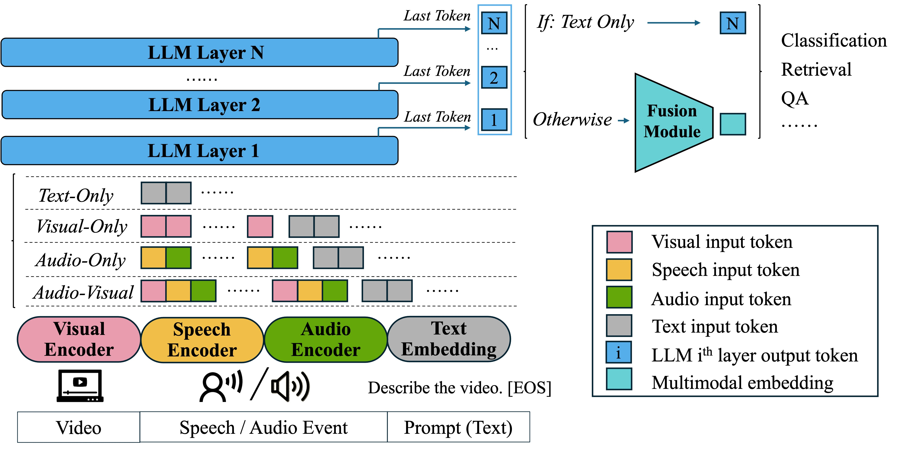

# WAVE: Learning Unified & Versatile Audio-Visual Embeddings with Multimodal LLM

<div align="center">

<!--  -->

<div>
    <a href="https://arxiv.org/pdf/2509.21990" target="_blank">
      
    </a>
    <a href="https://huggingface.co/tsinghua-ee/WAVE-7B" target="_blank">
      
    </a>
    <a href="https://github.com/TCL606/WAVE" target="_blank">
      
    </a>
    
</div>

</div>

---

## 🔥 News
*   **[2026/02/11]**: 🚀 We released the official code and model checkpoints!
*   **[2026/02/06]**: 🎉 **WAVE** has been accepted to **ICLR 2026 as an Oral Presentation**!

---

## 📖 Abstract

We introduce **WAVE** (Unified & **V**ersatile **A**udio-**V**isual **E**mbeddings), the first LLM-based embedding model that creates a unified representation space for text, audio, silent video, and synchronized audio-visual modalities.

Unlike previous methods that use separate encoders, WAVE is built upon **Qwen2.5-Omni** and employs a novel **hierarchical feature fusion strategy**. It features a dual-encoder design for audio (Speech + Environmental Sounds) and is trained via a joint multi-modal, multi-task approach.

**Key Capabilities:**
1.  **Any-to-Any Retrieval:** Seamlessly retrieve across text, audio, and video modalities.
2.  **Prompt-Aware Embeddings:** Generate embeddings tailored to user instructions (e.g., specific questions), significantly boosting performance in multimodal QA.
3.  **SOTA Performance:** WAVE achieves state-of-the-art results on the **MMEB-v2-video** benchmark and excels in audio/audio-visual retrieval tasks.

<div align="center">
  <!-- 请在仓库的 assets 文件夹中放入论文的 Figure 1 -->
  
  <br>
  <em>Overview of WAVE Architecture. It supports text-only, visual-only, audio-only, and audio-visual inputs.</em>
</div>

---

## 🏆 Performance

WAVE achieves SOTA performance on MMEB-v2-video, outperforming industrial-grade models like Seed-1.6-Embedding.

| Model | **Overall** | CLS | QA | RET | MRET |
| :--- | :---: | :---: | :---: | :---: | :---: |
| LamRA 7B | 35.0 | 39.3 | 42.6 | 24.3 | 32.8 |
| GME 7B | 38.4 | 37.4 | 50.4 | 28.4 | 37.0 |
| CAFe 7B | 42.4 | 35.8 | 58.7 | 34.4 | 39.5 |
| Seed-1.6-Embedding | 55.3 | 55.0 | 60.9 | 51.3 | **53.5** |
| **WAVE 7B (Ours)** | **59.9** | **57.8** | **72.5** | **54.7** | 50.8 |

WAVE also demonstrate strong performance across audio and audio-visual modalities.

| **Dataset** | **AudioCaps** | **Clotho** | **MMAU** | **MMAR** | **VGGSound** | **MusicCaps** |
| :--- | :---: | :---: | :---: | :---: | :---: | :---: |
| **Task** | A-RET | A-RET | A-QA | A-QA | AV-RET | AV-RET |
| **Reference** | WavCaps | WavCaps | Qwen2.5-Omni | Qwen2.5-Omni | Encoder-only | Encoder-only |
| **Ref. Value** | 42.2 | 21.5 | 71.5 | 56.7 | 10.3 | 8.6 |
| **WAVE 7B** | **44.2** | **25.6** | **76.6** | **68.1** | **25.0** | **20.4** |

## 🛠️ Installation

For key library versions, please refer to requirements.txt. Install via:

`pip install -r requirements.txt`

---

## 🤖 Model Zoo

We provide the model checkpoint on Hugging Face.

| Model | Parameters | Backbone | Download |
| :--- | :---: | :---: | :---: |
| **WAVE-7B** | 7B | Qwen2.5-Omni | [🤗 HuggingFace](https://huggingface.co/tsinghua-ee/WAVE-7B) |

---

## 🚀 Quick Start

To evaluate WAVE on your own datasets or benchmarks, follow these steps:

1.  **Data Preparation**: Organize your data into the sample JSON format. Refer to the templates provided in the `scripts/` directory, such as:
    *   `scripts/ret_av2t.json` (video/audio to text retrieval)
    *   `scripts/ret_mc.json` (QA)
    *   `scripts/ret_v2a.json` (audio-visual retrieval)

2.  **Inference**: Modify `scripts/direct_test.sh`, then run the script:
    ```bash
    bash scripts/direct_test.sh
    ```
    The results will be automatically saved in the `output/test` directory.

---

## 📝 Citation

If you find WAVE useful for your research, please consider citing our paper:

```bibtex
@inproceedings{tang2026wave,
    title={{WAVE}: Learning Unified \& Versatile Audio-Visual Embeddings with Multimodal {LLM}},
    author={Changli Tang and Qinfan Xiao and Ke Mei and Tianyi Wang and Fengyun Rao and Chao Zhang},
    booktitle={The Fourteenth International Conference on Learning Representations},
    year={2026},
    url={https://openreview.net/forum?id=MiV3WXDYJb}
}
```

---
*License: Apache 2.0*